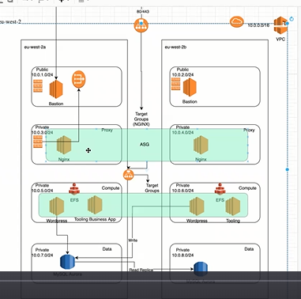
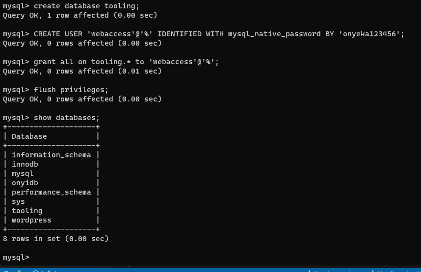
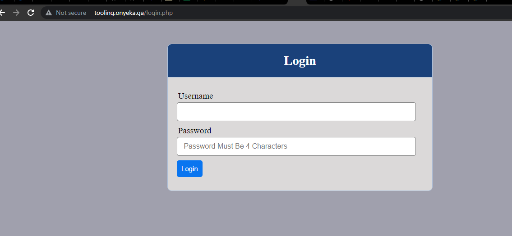
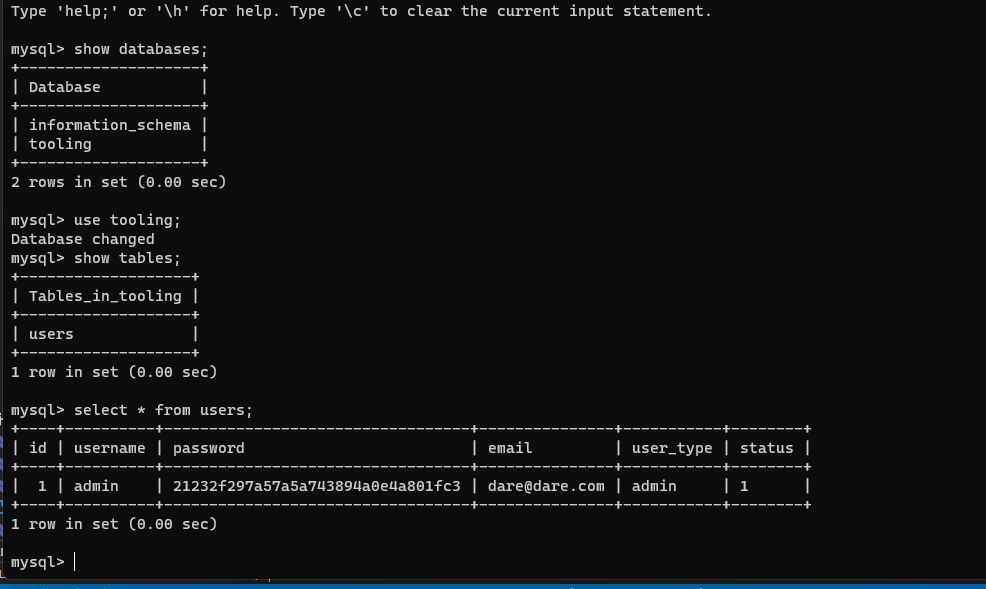
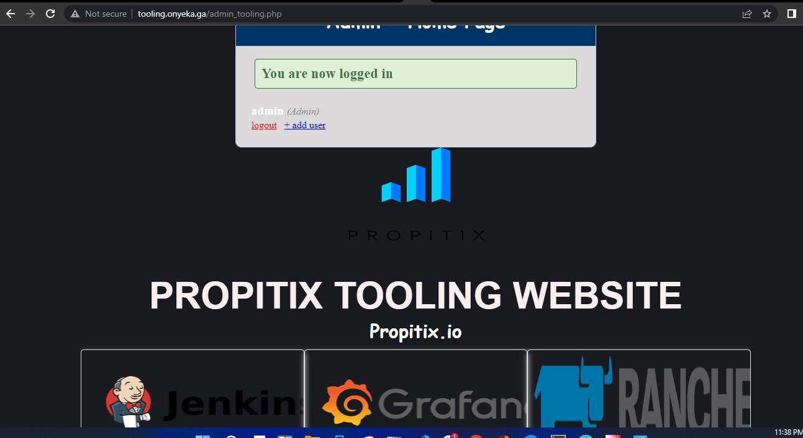

# Project-15-version-B

We want to upgrade and add more features to our previous project 15 infrastructure. We want to remove the Nginx proxy server from the public subnet and put it into a private subnet to enhance more security so tat every traffic reaching our nginx proxy must be coming from the loadbalancer or the bastion host. Below is our architecture:



We also want to deploy the above architecture with terraform and write our code such that we can reuse the code base and deploy to different environment using modules. The plan is to start from the scratch and refactor the code when due. So our terraform-iteration1 folder will contain our **step one** simple hard-coded terrafom codes while the terraform-iteration2 folder will contain the refactored codes, **modules**. Our guide will be as follows:

## Implementation guide 
1. Create a VPC
2. Create the subnets 
3. Create the Internet Gateway
4. Create route table for the public subnet to use  (Public Route Table)
5. Create a route in the public route table and point to the Internet gateway
6. Associate the public subnets to the created route table
7. Create a NAT Gateway so that servers in the private subnet can reach the internet to for example download stuff (Outbound)
8. Create route table for the private subnet to use (Private Route Table)
9. Create a route in the created route table and point to the NAT Gateway
10. Associate the private subnets (for compute only) to the private route table
11. Create security group for Bastion. Allow all DevOps engineers to connect over SSH to the Bastion server
12. Create security group and allow the entire world to talk to the ALB (HTTP/HTTS)
13. Create security group and allow the ALB to talk to the Nginx proxy server. (Nginx). Also allow Bastion to talk to nginx
14. Create security group for internal ALB. (Alow traffic from Nginx proxy)
15. Create Security group for Wordpress site (Allow traffic from internal ALB)
16. Create Security group for Tooling site (Allow traffic from internal ALB)
17. Create Security group for datalayer (Allow traffic from wordpress and tooling server) and  Security Group for EFS - Allow access from Tooling and Wordpress on NFS port
18. Create a Launch Template for Bastion (Use a redhat based AMI) (include subnet settings for auto scaling in templates) 
19. Create ASG for Bastion
20. Create a Launch Template for nginx (Use a redhat based AMI) (Private network)
21. Create ASG for nginx
Configure instance profile and give the tooling and wordpress instances relevant permissions to access AWS resources (for example, S3, EFS)
22. Create Launch Template for Tooling ASG (Ensure the IAM for instance profile is configured) (RedHat Linux)
23. Create ASG for Tooling instances
24. Create Launch Template for Wordpress ASG (Ensure the IAM for instance profile is configured)  (RedHat Linux)
25. Create ASG for Wordpress instances
26. Create an External facing Application Load Balancer (ALB)
27. Create nginx target group
28. Create a Listener (port 80)
29. Create target group for Wordpress site
30. Create target group for tooling site
31. Create internal ALB and configure listeners with Host header rules for default web page, wordpress and tooling sites
32. Create the KMS key for RDS data encryption
33. Create EFS File system (SG)
34. Create DB subnet group
35. Create RDS/Aurora Database
36. Create Route53 entry. Point the Domain name to the public ALB 

Plan and apply the code with the command below

```
terraform plan --var-file=environment/dev/dev.tf

terraform apply --var-file=environment/dev/dev.tf
```

## configure the servers
37. Connect to Bastion server launched in the Public Subnet over SSH
38. Connect to the nginx server launched in the Private Subnet (Use SSH Agent to forward the public IP)
39. Ensure that the nginx Target group is healthy
    1.  Check the security of the instance and ensure it allows port 80
40. Connect to server and Install nginx
41. Configure nginx to upstream to internal ALB

# Configure Proxy 
```
sudo unlink /etc/nginx/sites-enabled/default

sudo vi /etc/nginx/sites-available/tooling-reverse-proxy.conf
```

# Configure Tooling Reverse Proxy

```
server {
    listen 80;
    server_name tooling.onyeka.ga;
    location / {
        proxy_pass http://internal-test-288727612.eu-west-2.elb.amazonaws.com/;
        proxy_set_header Host $host;
    }
  }
```

```
sudo ln -s /etc/nginx/sites-available/tooling-reverse-proxy.conf /etc/nginx/sites-enabled/tooling-reverse-proxy.conf
```

# Configure Wordpress Reverse Proxy

```
sudo vi /etc/nginx/sites-available/wordpress-reverse-proxy.conf

server {
    listen 80;
    server_name wordpress.onyeka.ga;
    location / {
        proxy_pass http://internal-test-288727612.eu-west-2.elb.amazonaws.com/;
        proxy_set_header Host $host;
    }
  }
```

```
sudo ln -s /etc/nginx/sites-available/wordpress-reverse-proxy.conf /etc/nginx/sites-enabled/wordpress-reverse-proxy.conf 

sudo nginx -t

sudo systemctl reload nginx
```

42. Configure instance profile and give the tooling and wordpress instances relevant permissions to access AWS resources (for example, S3, EFS)

43. Configure Tooling and Wordpress (A simulation)

## Install WordPress on your Wordpress Server 

1. Update the repository

```
sudo yum -y update
```

2. Install wget, Apache and it’s dependencies

```
sudo yum -y install wget httpd php php-mysqlnd php-fpm php-json
```

3. Start Apache

```
	sudo systemctl enable httpd

	sudo systemctl start httpd
```


4. To install PHP and it’s depemdencies

```
	sudo yum install https://dl.fedoraproject.org/pub/epel/epel-release-latest-8.noarch.rpm

	sudo yum install yum-utils http://rpms.remirepo.net/enterprise/remi-release-8.rpm

	sudo yum module list php

	sudo yum module reset php

	sudo yum module enable php:remi-7.4

	sudo yum install php php-opcache php-gd php-curl php-mysqlnd
	
	sudo systemctl start php-fpm

	sudo systemctl enable php-fpm

	sudo setsebool -P httpd_execmem 1

	sudo systemctl restart httpd
```

5. Download wordpress and copy wordpress to var/www/html

```
	mkdir wordpress

	cd   wordpress

	sudo wget http://wordpress.org/latest.tar.gz
 
	sudo tar -xzvf latest.tar.gz
 
	sudo rm -rf latest.tar.gz
 
	sudo cp -R wordpress /var/www/html/

	sudo systemctl restart httpd
```

### cd into /var/www/html directory

```
	cd wordpress

	sudo cp wp-config-sample.php wp-config.php
```

**Note** that at this point with the public ip address, the webserver will be serving the redhat page on the browser and will serve the wordpress page when you add /wordpress to public ip on the browser.

But we want the webserver to serve the wordpress page with only the public ip on the browser.

To this, we have to edit the  apache http server configuration file **httpd.conf** located at **/etc/httpd/conf/httpd.conf**. This contains the configuration directives that gives the server its instructions.

This contains the document root which is the directory out of which you will server your documents. 

 Change it from **"/var/www/html"** to **"/var/www/html/wordpress"**


6. Configure SELinux Policies

```
	sudo chown -R apache:apache /var/www/html/wordpress

	sudo chcon -t httpd_sys_rw_content_t /var/www/html/wordpress -R  
	
	sudo setsebool -P httpd_can_network_connect=1
```
## Configure RDS to work with WordPress

1. With the MySQL client install in your bastion, connect to your RDS server

```
sudo mysql -u <username> -p -h <amazon rds endpoint>
```

```
	CREATE DATABASE wordpress;

	CREATE USER 'onyeka-user'@'%' IDENTIFIED BY 'onyeka12345';

	GRANT ALL ON wordpress.* TO 'onyeka-user'@'%';

	FLUSH PRIVILEGES;

	SHOW DATABASES;

	exit
```
To show the users in a database do

```
SELECT User, Host FROM mysql.user;
```

To remove a user do 

```
DROP USER 'username'@'host';
```

## Step 6 — Configure WordPress to connect to remote database.

```
	sudo mysql -u onyeka-user -p -h <amazon rds endpoints>
```

2. Verify if you can successfully execute `SHOW DATABASES;` command and see a list of existing databases.

3.**cp wp-config-sample.php wp-config.php** this is creating another file wp-config.php which 
		contains the scipt which wordpress uses for installation.This contains database setting where to put the values of the database user name, password, host name so that the webserver can be able to connect to the database server. 

 **Note** that the host name here should be the endpoint of the RDS server.


## Configure Tooling site

## STEP 2 — CONFIGURE THE DATABASE SERVER

1. Create a database and name it tooling

```
create database tooling;
```

2. Create a database user and name it webaccess with password 'onyeka123456'

```
CREATE USER 'webaccess'@'<webservers subnet cidr>' IDENTIFIED WITH mysql_native_password BY 'onyeka123456';
```

3. Grant permission to webaccess user on tooling database to do anything only from the 

```
grant all on tooling.* to 'webaccess'@'<webservers subnet cidr>';

flush privileges;
```


4. Install Remi’s repository, Apache and PHP on your tooling server

```
sudo yum install httpd -y
sudo dnf install https://dl.fedoraproject.org/pub/epel/epel-release-latest-8.noarch.rpm
sudo dnf install dnf-utils http://rpms.remirepo.net/enterprise/remi-release-8.rpm
sudo dnf module reset php
sudo dnf module enable php:remi-7.4
sudo dnf install php php-opcache php-gd php-curl php-mysqlnd
sudo systemctl start php-fpm
sudo systemctl enable php-fpm
sudo setsebool -P httpd_execmem 1
``` 

8. Fork the tooling source code from 'Darey.io Github Account' to your Github account. You have to install git and initialise the repository before you can be able to fork.

```
sudo yum install git

git init

git clone <https address of the repository you want to fork>
```

9. Deploy the tooling website’s code to the Webserver. Ensure that the 'html folder' from the repository is deployed to '/var/www/html'. 
From inside the tooling folder, run this command

```
sudo cp -R html/. /var/www/html

sudo systemctl restart httpd
```

This will copy recurssively the content of the html folder that is in the tooling folder into the html folder which is in the /var/www folder

### Trouble shooting if any
**Note** If you encounter 403 Error – check permissions to your /var/www/html folder and also disable SELinux 'sudo setenforce 0'

To make this change permanent – open following config file **sudo vi /etc/sysconfig/selinux** and set **SELINUX=disabled** then restrt httpd.

Check whether apache is up and running with this command

```
sudo systemctl status httpd

sudo setenforce 0

sudo vi /etc/sysconfig/selinux

Set **SELINUX=disabled**

sudo systemctl restart httpd
```



10. Update the website’s configuration to connect to the database in /var/www/html/functions.php file.

```
sudo vi /var/www/html/functions.php
```

update the database the endpoint of the rds, user = webaccess, the password = onyeka123456 

```
// connect to database
$db = mysqli_connect('mysql.tooling.svc.cluster.local', 'admin', 'admin', 'tooling');
```

11. Connect to rds with webaccess credentials

```
mysql -h <rds endpoint> -u webaccess -p tooling < tooling-db.sql
```    

11. Go back to the database terminal. Create in MySQL a new admin user with username: myuser and password: password:

```
show databases;

use tooling;

show tables;

select * from users;
```



Open the website in your browser http://tooling.onyeka.ga/index.php and make sure you can login into the webste with user = admin, password = admin




## SSH Config Sample
Host *
     StrictHostKeyChecking no

Host bastion
    ForwardAgent yes
    HostName 18.134.146.217
    Port 22
    User ec2-user
    IdentityFile ~/Downloads/temp-delete.cer

Host proxy
    ForwardAgent yes
    HostName 18.134.146.217
    Port 22
    User ec2-user
    IdentityFile ~/Downloads/temp-delete.cer
    ProxyCommand ssh bastion -W %h:%p

Host tooling
    ForwardAgent yes
    HostName 10.0.5.183
    Port 22
    User ec2-user
    IdentityFile ~/Downloads/temp-delete.cer
    ProxyCommand ssh bastion -W %h:%p


## Userdata for nginx (for redhat)
```
sudo yum update -y
sudo yum install -y https://dl.fedoraproject.org/pub/epel/epel-release-latest-8.noarch.rpm
sudo yum install -y dnf-utils http://rpms.remirepo.net/enterprise/remi-release-8.rpm
sudo yum install -y nginx git
sudo systemctl restart nginx
### Update the web page  
sudo vi /usr/share/nginx/html/index.html
```

 Install **botocore** - https://docs.aws.amazon.com/efs/latest/ug/install-botocore.html

```
sudo yum update -y
sudo yum install -y https://dl.fedoraproject.org/pub/epel/epel-release-latest-8.noarch.rpm
sudo yum install -y dnf-utils http://rpms.remirepo.net/enterprise/remi-release-8.rpm
sudo yum -y install wget python3 git
```

```
if [[ "$(python3 -V 2>&1)" =~ ^(Python 3.6.*) ]]; then
    sudo wget https://bootstrap.pypa.io/pip/3.6/get-pip.py -O /tmp/get-pip.py
elif [[ "$(python3 -V 2>&1)" =~ ^(Python 3.5.*) ]]; then
    sudo wget https://bootstrap.pypa.io/pip/3.5/get-pip.py -O /tmp/get-pip.py
elif [[ "$(python3 -V 2>&1)" =~ ^(Python 3.4.*) ]]; then
    sudo wget https://bootstrap.pypa.io/pip/3.4/get-pip.py -O /tmp/get-pip.py
else
    sudo wget https://bootstrap.pypa.io/get-pip.py -O /tmp/get-pip.py
fi
```

```
sudo python3 /tmp/get-pip.py
pip install botocore


setsebool -P httpd_can_network_connect=1
setsebool -P httpd_can_network_connect_db=1
setsebool -P httpd_execmem=1
setsebool -P httpd_use_nfs 1


git clone https://github.com/aws/efs-utils
cd efs-utils
sudo yum install -y make
sudo yum install -y rpm-build
sudo make rpm 
sudo yum install -y  ./build/amazon-efs-utils*rpm

sudo mkdir /var/www
sudo mount -t efs -o tls fs-0dd171cec888d1c4a:/ /var/www
```

### Home Work

Relying on your recent experience working with Tooling website, NFS, MySQL Database and cloud concepts. Implement the entire project end to end deploying the real tooling application. Ensure that its configuration points to the RDS/Aurora Database you created.

-- Use any performance testing tool to stress the servers so that autoscaling can be triggered.
-- Implement more sub domain websites
-- Using your knowledge and experience working with lets encrypt to configure TLS/SSL. Learn how ACM works, and terminate SSL on the public load balancer
-- Ensure to configure /etc/fstab after mounting EFS

